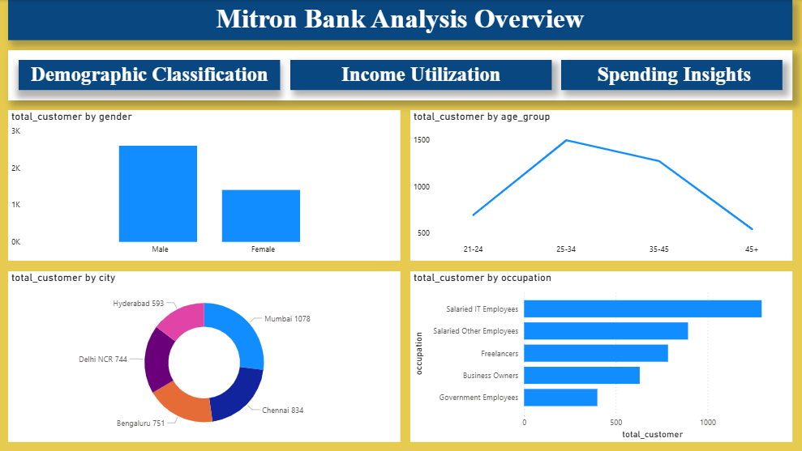
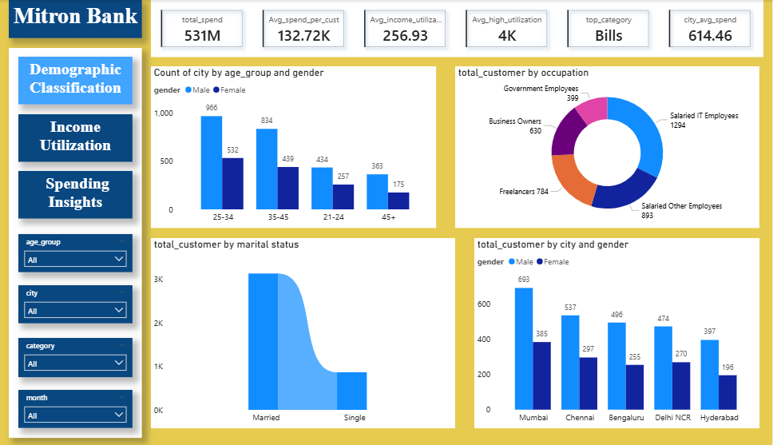
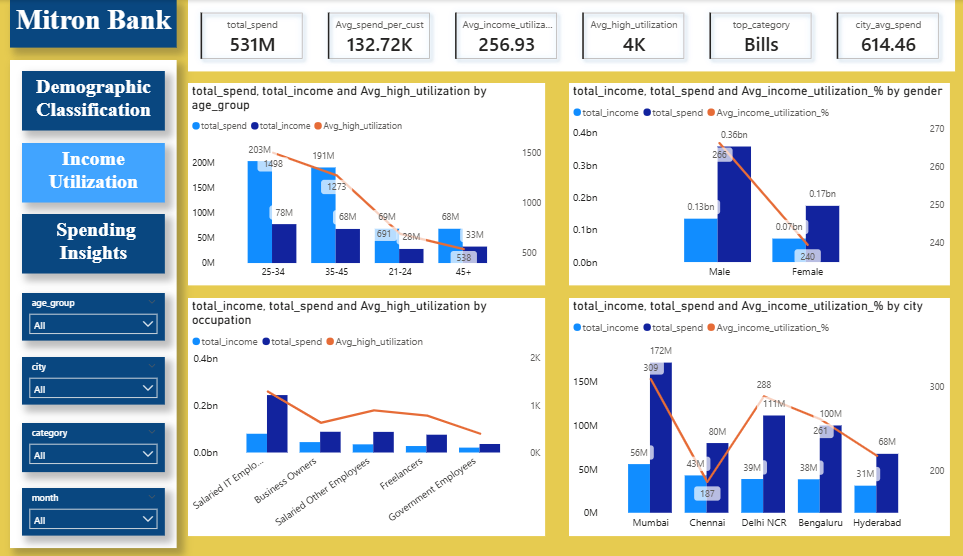
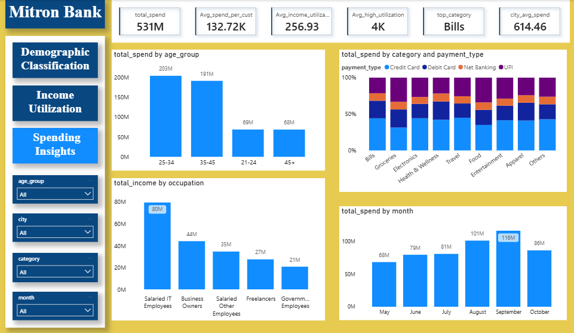

# Mitron Bank Analysis
## Project Summary
Mitron Bank project analyzes customer demographics, income utilization, and spending behavior for a banking dataset using Power BI. The dashboard provides insights into customer age groups, gender, occupation, city-wise distribution, and payment preferences. Key KPIs highlight total spend, average spend per customer, and income utilization levels. The analysis helps identify high-value customer segments, major spending categories, and regional trends, supporting better marketing, product, and customer engagement decisions.

[Click here to view Live Dashboard](https://app.powerbi.com/view?r=eyJrIjoiMGY0OWMyZmUtMzZkYy00NmY2LWJmNTktNTQ4ODUzYjNkYmQ2IiwidCI6IjNmZmZmN2I2LTdlZjQtNGZhNC04ZmVhLTc5OGFiMDQ1NTcxNCJ9)

## Table of Content
1. [Tool Used](#tool-used)
2. [Business Objective](#business-objective)
3. [Dataset Overview](#dataset-overview)
4. [Key Performance Indicators (KPIs)](#key-performance-indicators-kpis))
5. [Overview](#overview)
6. [Demographic Analysis](#demographic-analysis)
7. [Income Utilization Analysis](#income-utilization-analysis)
8. [Spending Behaviour Analysis](#spending-behaviour-analysis)
9. [Business Recommendations](#business-recommendations)
10. [Conclusion](#conclusion)

### Tool Used 
Power-BI , Excel

Domain: Banking & Financial Services

## Business Objective
The objective of this analysis is to understand customer profile, income behaviour, and spending patterns for Mitron Bank.
The dashboard helps answer key business questions such as:
-	Who are the bank’s primary customers?
-	Which customer segments contribute the most income and spend?
-	How effectively do customers utilize their income?
-	Which cities, categories, and payment methods drive transactions?
This analysis can support marketing strategy, customer segmentation, and product planning.

[Home](#table-of-content)

## Dataset Overview
The dataset includes customer-level information across:
-	Demographics (age group, gender, marital status, occupation)
-	Geographic location (city)
-	Monthly income and spending
-	Spending categories and payment methods
-	Time-based transaction data

[Home](#table-of-content)

## Key Performance Indicators (KPIs)
- Total Spend: 531M
- Average Spend per Customer: 132.72K
- Average Income Utilization: 256.93%
- High Utilization Customers: 4K
- Top Spending Category: Bills
- Average City Spend: 614.46

[Home](#table-of-content)

## Overview 

[Home](#table-of-content)

## Demographic Analysis  

## Key Insights

### Customer Distribution
- Male customers form a larger share of the customer base compared to female customers.
- The 25–34 age group has the highest number of customers, followed by 35–45.
- Customer presence declines in the 21–24 and 45+ age groups.

### City & Occupation Profile
- Mumbai has the highest number of customers, followed by Chennai, Bengaluru, and Delhi NCR.
- Salaried IT employees represent the largest occupational segment.
- Married customers significantly outnumber single customers.

[Home](#table-of-content)

## Income Utilization Analysis  

## Key Insights

### Income and Spend by Age Group
- Customers aged 25–34 and 35–45 generate the highest total income and spending.
- Income utilization is strongest among these age groups.

### Gender-wise Income Behaviour
- Male customers contribute higher total income and spending.
- Female customers show slightly lower income utilization but stable spending behaviour.

### Occupation & City-wise Utilization
- Salaried IT employees show the highest income and utilization levels.
- Business owners and freelancers also demonstrate strong utilization.
- Mumbai, Delhi NCR, and Bengaluru lead in income and spending, while utilization varies by city.
  

[Home](#table-of-content)

## Spending Behaviour Analysis  

## Key Insights

### Spending by Age Group
- The 25–34 age group contributes the highest total spending.
- Spending decreases significantly after the age of 45.
  
### Category & Payment Method Trends
- Bills is the top spending category, indicating high recurring transactions.
- UPI is the most preferred payment method across all categories.
- Groceries, electronics, food, and travel show consistent spending.

### Monthly Spending Trend
- Spending increases steadily from May to September.
- A slight decline is observed in October.

[Home](#table-of-content)

## Business Recommendations
-	Focus marketing efforts on the 25–45 age group, as they contribute the highest income and spend.
-	Design premium credit and loan products for Salaried IT employees and business owners.
-	Promote UPI-based offers and rewards to increase transaction frequency.
-	Prioritize Mumbai, Delhi NCR, and Bengaluru for customer acquisition and cross-sell campaigns.
-	Use city-level utilization insights to create localized marketing strategies.

[Home](#table-of-content)

## Conclusion
This dashboard provides a comprehensive view of customer demographics, income utilization, and spending behaviour for Mitron Bank.
The analysis highlights high-value customer segments, key spending drivers, and regional patterns that can support data-driven decision-making. 

[Home](#table-of-content)

